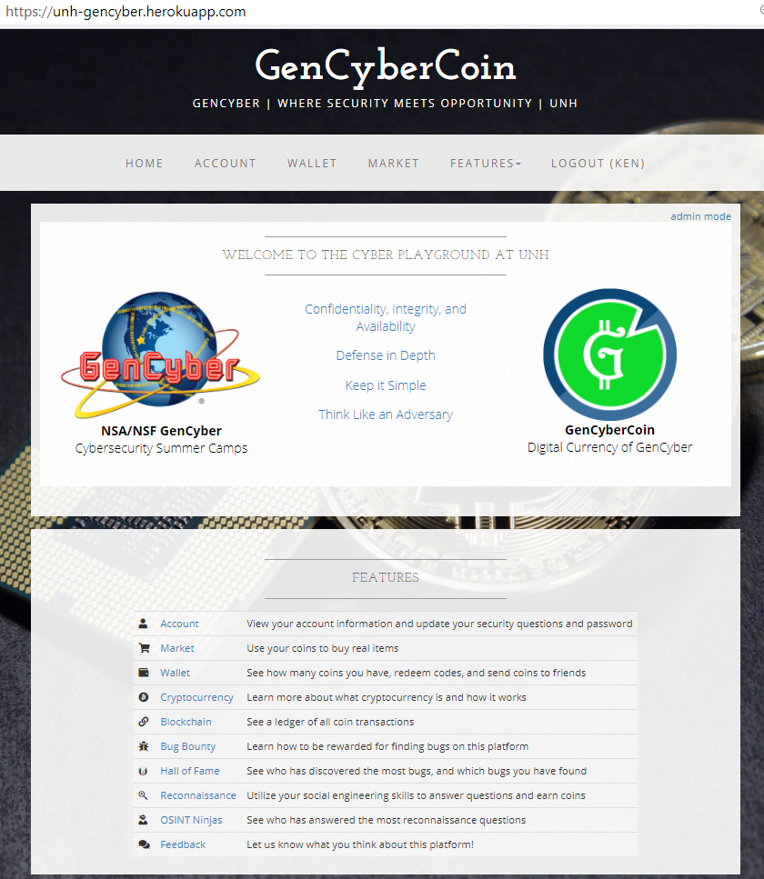
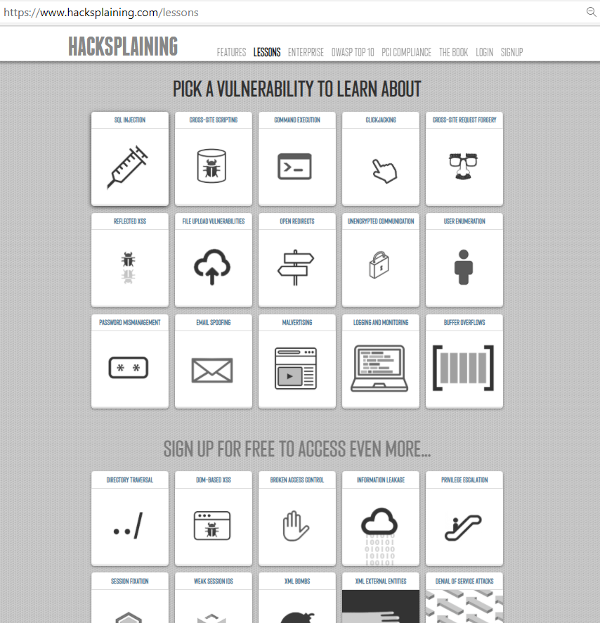

# UNH GenCyber : Monday "Hello World!" Lesson Plan
# Introductions, Social Engineering, and Bug Bounty Hunting
This first day of camp has an opening session not included in this daily lesson plan.  The opening session will cover: camp specific logistics, safety policies, and rules of conduct. 

## Lesson Description
As this is their first day together, students will learn about follow classmates through the exchange of personal stories.  Students will perform research and reconnaissance, the Open Source Intelligence Gathering (OSINT), activities required for effective social engineering.  Students will discover a variety of client- and server-side bugs and automatically get rewarded with GenCyberCoins for those. Some bug examples: sensitive data exposure, broken authentication, XSS, user input validation, and directory Traversal.
### Prerequisite Knowledge
Students should have a basic understanding of how to use a web browser and be able to engage using remote meeting tools.

### Schedule
The lesson has three (3) modules. Each module starts with a brief (15 minute) overview to provide context, instructions, and goals for the students.  Student typically complete each module in 90-120 minutes.  The modules have the following sequence.  
Module 1: Introductions  
 All students and instructors take three (3) minutes to present their personal story to the class.  The story can be an event, place, or emotion the student would like to share. The story is meant to be an ice-breaker, it is used in the next module, and again in lessons later in the week.  
 Module 2: Social Engineering  
 This module uses the reconnaissance features of GenCyberCoin.  For each student story, instructors will post a single question.  Students receive points (coins) for each correct answer.  The questions will require a small amount of research time (less than 5 minutes).  Instructors may post additional group questions to foster additional student exchanges.
 Module 3: Bug Bounty Hunting 
 This module uses a series of programming flaws built into GenCyberCoin. The game provides a list of bugs to locate, with hints.  The listed is roughly ordered by difficulty.  Coins are rewarded for each bug successfully located.  Students work at their own pace, are encouraged to collaborate on methods, and not required to complete all tasks.
### Level of Instruction
The lesson is intended for high school learners (beginner and intermediate levels)

## Applicable First Principles and Concepts

### GenCyber First Principles
<table border="0">
 <tr>
  <td><i>Abstraction</i></td>
   <td><i>Data Hiding</i></td>
   <td>Domain Separation</td>
   <td><i>Layering</i></td>
   <td><i>Least Privilege</i></td>
 </tr>
 <tr>
   <td>Minimization</td>
   <td><i>Modularity</i></td>
   <td>Process Isolation</td>
   <td><i>Encapsulation</i></td>
  <td><i>Simplicity</i></td>
 </tr>
</table>
### GenCyber Cybersecurity Concepts
<table border="0">
 <tr>
  <td>Availability</td>
  <td><i>Confidentiality</i></td>
  <td><i>Defense in Depth</i></td>
 </tr>
 <tr>
  <td><i>Integrity</i></td>
  <td><i>Keep it Simple</i></td>
  <td><i>Think like an Adversary</i></td>
 </tr>
</table>
 
## Resources & Requirements
- Before the beginning of the lesson.  Each student needs to provide a personal story about an event in their life.  It can be an event, place, or emotion they would like to share.  It is meant to be brief less than 100 words, but must contain at least twenty words six characters or longer.  The last requirement is for lessons later in the week.
- Each student needs access to a browser and have the ability to connect to the remote meeting with both video and audio.
- Websites/Software used  
 - [GenCyberCoin Game](https://github.com/vitalyford/gencybercoin)  
  
 - [Hacksplaining](https://hacksplaining.com)  
  

### Accommodations Needed
Special technical setup may be needed for students who are visually or physically impaired to use the
computer.

## LESSON LEARNING OUTCOMES
- Demonstrate the ability to think like an adversary and identify what can go wrong on a website
- Demonstrate the ability to use Internet resources to gather relevant information during a reconnaissance effort.
- Learn about different types of vulnerabilities that are typical for websites.
- Learn the basics of web ethical hacking and exploitation.

## LESSON DETAILS
### Assessment
The assessment for this lesson is a combination of informal observation and game statistics:
- The number of students answering the Reconnaissance questions correctly (the OSINT Ninjas
page).
- The results of the Bug Bounty activity (the Hall of Fame page).
### Extension Activities on the Hacksplaining site
- Learn about additional web attacks.
### Extension Activities on the GenCyberCoin platform
- Learn about password strength, where to check if the email and password have been
compromised, and how to correctly manage it.
- Learn about digital currency.
- Learn about blockchain and its applications beyond cryptocurrency.
### Differentiated Learning Opportunities
Advanced students can learn more attacks and find more bugs within the allocated time and learn more by exploring the links
that are related to the found bugs. Also, advanced students can discover more sophisticated search
queries by spending more time reading the material provided in the Reconnaissance activity.
## LESSON PREPARATION
### Introductions
 - Validate all students have posted their personal story prior to the start of lesson
### Hacksplaining
- Review lessons on [Hacksplaining](https://hacksplaining.com)
- Students should authenticate to see all lessons. 
- The Bug Bounty Hunting uses lessons: Cross-Site Scripting, Reflected XSS, Weak Session ID, Information Leakage, Directory Traversal, and Cross-site Request Forgery.
### GenCyberCoin
 - The instructor can learn how the GenCyberCoin platform works by watching a [12-minute video](https://github.com/vitalyford/gencybercoin).  
 - The **instructor** needs to follow the directions for deploying on Heroku.  
 - Review the [solutions walkthrough](https://arcadia.hosted.panopto.com/Panopto/Pages/Viewer.aspx?id=14f839b7-0dd7-4816-87f8-aa4f013c6ca2)
 - After the system is deployed, login in with “gcsuperuser/gcsuperuser” credentials, change the password.
 - Generate registration code for (admins), normally the instructor and all teaching assistants
 - Generate registration code for (student), a sinlge infinite code works well.
 - Add recon questions based on student stories.
 - Add items to marketplace
 - Create new badges and activity information as needed.
## LESSON DELIVERY
### Module 1: Introductions  
- All students and instructors take three (3) minutes to present their personal story to the class.
### Module 2: Social Engineering  
- The instructor shows a [2-minute video](https://github.com/vitalyford/gencybercoin) about the GenCyberCoin platform to the students.
- Students navigate to the shared URL and register with the shared registration code.
- Students navigate to Features → Reconnaissance to learn about Open Source Intelligence Gathering (OSINT) and Social Engineering.
- Students answer as many questions as they can on the Reconnaissance page.
- Everybody can see everyone’s progress on the OSINT Ninjas page.
### Module 3: Bug Bounty Hunting 
#### Hacksplaining
- Use the lessons on [Hacksplaining](https://hacksplaining.com) to introduce the types of bug to found in GenCyberCoin.
- Students should authenticate to see all lessons, social network authentication is recommended over email.  Instructors will lead as students follow along.
- The Bug Bounty Hunting uses the following lessons: Cross-Site Scripting, Reflected XSS, Weak Session ID, Information Leakage, Directory Traversal, and Cross-site Request Forgery.  Each lesson takes 3-4 minutes.

#### GenCyberCoin
This module uses a series of programming flaws built into GenCyberCoin. 
- Login at URL provided to the class.
- Navigate to Features → Bug Bounty to learn about what kinds of bugs to search for on the
platform. There are hints in place to help you find those bugs.
- The listed is roughly ordered by difficulty.
- Coins are rewarded for each bug successfully located.
- Students work at their own pace, are encouraged to collaborate on methods, and not required to complete all tasks.
Student information
- Find as many bugs as possible on the Bug Bounty page. Everybody can see everyone’s progress
on the Hall of Fame page.
- As students progress through the activities, they automatically earn GenCyberCoins and every
action/transaction is tracked on the Blockchain (Features → Blockchain).
- Discuss the details of Reconnaissance and Bug Bounty as well as their implications in the real
world.
### Questions/Concerns/Suggestions/Bugs
Please post issues to the [GitHub page](https://github/kengraf/GenCyber)
