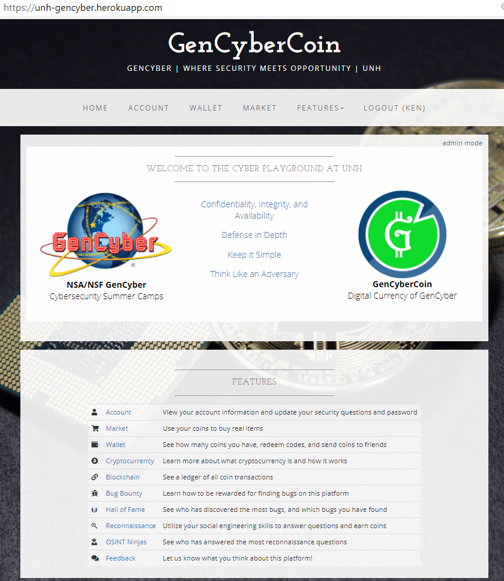
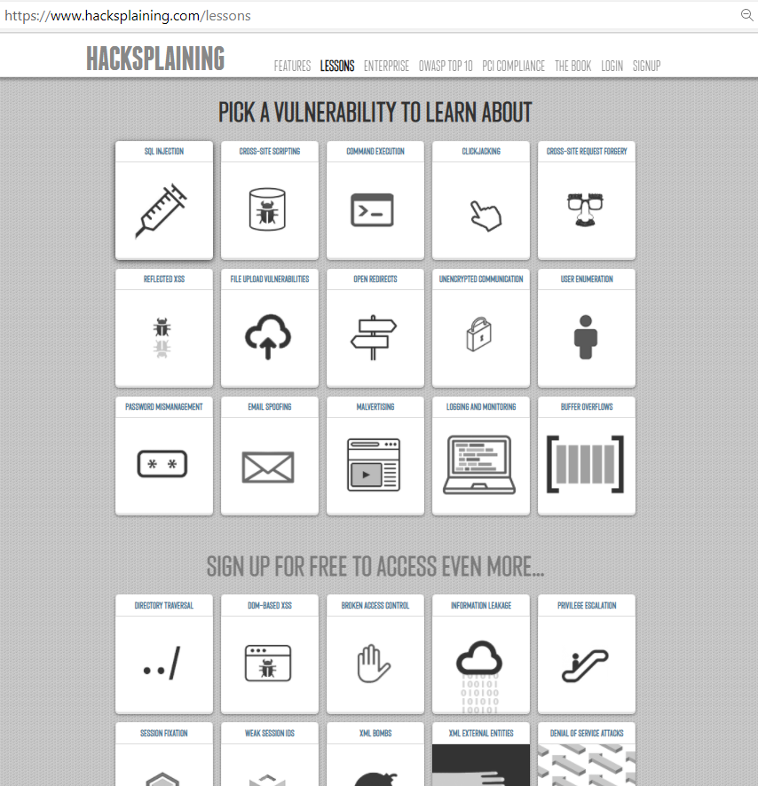

# UNH GenCyber : Thursday: “Virtual treasure hunts” Lesson Plan
TBD

## Lesson Description
TBD

### Prerequisite Knowledge
Students should have a basic understanding of how to use a web browser and be able to engage using remote meeting tools.

### Length of Completion
The lesson has three (3) modules. Each module starts with a brief (15 minute) overview to provide context, instructions, and goals for the students.  Students typically complete each module in 90-120 minutes.  These lessons are based on Google Maps and Wikipedia and require Search and Cyberchef knowledge.  

*Module 1: New Hampshire*  
TBD
*Module 2: United States*  
TBD
*Module 3: World*  
TBD
### Level of Instruction
The lesson is intended for high school learners (beginner and intermediate levels)

## Applicable First Principles and Concepts

### GenCyber First Principles
<table border="0">
 <tr>
  <td><i>Abstraction</i></td>
   <td><i>Data Hiding</i></td>
   <td>Domain Separation</td>
   <td>Layering</td>
   <td>Least Privilege</td>
 </tr>
 <tr>
   <td>Minimization</td>
   <td>Modularity</td>
   <td>Process Isolation</td>
   <td><i>Encapsulation</i></td>
  <td><i>Simplicity</i></td>
 </tr>
</table>
### GenCyber Cybersecurity Concepts
<table border="0">
 <tr>
  <td>Availability</td>
  <td><i>Confidentiality</i></td>
  <td>Defense in Depth</td>
 </tr>
 <tr>
  <td><i>Integrity</i></td>
  <td><i>Keep it Simple</i></td>
  <td><i>Think like an Adversary</i></td>
 </tr>
</table>
 
## Resources & Requirements
- Each student needs access to a browser and have the ability to connect to the remote meeting with both video and audio.
- Websites/Software used  
[GenCyberCoin Game](https://github.com/vitalyford/gencybercoin)  
  

- [Hacksplaining](https://hacksplaining.com)  
  

## Accommodations Needed
Special technical setup may be needed for students who are visually or physically impaired to use the
computer or engage in a remote meeting.

## LEARNING OUTCOMES
- Demonstrate the ability to think like an adversary and identify what can go wrong on a website
- Demonstrate the ability to use Internet resources to gather relevant information during a reconnaissance effort.
- Learn about different types of vulnerabilities that are typical for websites.
- Learn the basics of web ethical hacking and exploitation.

## LESSON DETAILS
### Assessment
The assessment for this lesson is a combination of informal observation and game statistics:
- The number of students answering .. TBD

### Differentiated Learning Opportunities
Advanced students can learn more TBD
## LESSON PREPARATION
### General TBD
### SOFTWARE TBD
## LESSON 
### Module 1: TBD, repeat for each module
TBD
### Questions/Concerns/Suggestions/Bugs
Please post issues to the [GitHub page](https://github/kengraf/GenCyber)
